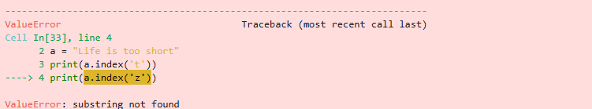

```python
print("{{}}".format())
```

    {}


```python
n = "a"
m = 30
print(f"{"hi"} {"bye"}")
print(f"{n} {m+1}")
```

    hi bye
    a 31


```python
d = {'name':"홍길동", 'age':30}
# f포매팅 주의할 점
# 딕셔너리의 값을 표현할 때 괄호로 묶어 표기하고 공백을 주의하라
print(f"{(d['name']):<10} {(d['age']):^20}") # 괄호가 들어가야 함
```

    홍길동                 30         


```python
# f문자열을 사용하여 세자리 콤마 찍기
btc = 75000
ssum = btc * 1450
f"{ssum:,}"
```


    '108,750,000'


### 문자열 관련 함수들


```python
# count - 문자 개수 세기
a = "hobby"
b = "appleeee"
print(a.count("b"))
print(b.count("e"))
```

    2
    4


```python
# find - 위치 알려 주기
a = "Python is the best choice"
print(a.find('b'))
print(a.find('P'))
print(a.find('x'))
```

    14
    0
    -1


```python
# index - 위치 알려 주기 2
a = "Life is too short"
print(a.index('t'))
# print(a.index('z')) 찾는 값이 없으면 오류 발생
```

    8


**오류 발생**
</br>
</img>


```python
# join - 문자열 삽입
ss = 'abcdefg'
print("-".join(ss))
print("a","b","c", sep="-")
```

    a-b-c-d-e-f-g
    a-b-c


```python
# a*b*c*d*e*f*g
print("*".join(ss))
```

    a*b*c*d*e*f*g


```python
# upper - 소문자를 대문자로 바꾸기
a = "Python is the best choice"
print(a.upper())
# Lower - 대문자를 소문자로 바꾸기
b = "Python is the best choice"
print(b.lower())
c = "Python is the best choice"
print(c[0] + c[1:].lower())
```

    PYTHON IS THE BEST CHOICE
    python is the best choice
    Python is the best choice


```python
ss = f"{'hi':^12}"
print(ss)
# lstrip - 왼쪽 공백 지우기
print(ss.lstrip())
# rstrip - 오른쪽 공백 지우기
print(ss.rstrip())
# strip - 양쪽 공백 지우기
print(ss.strip())
```

         hi     
    hi     
         hi
    hi


```python
# replace - 문자열 바꾸기 **
a = "Life is too short"
a = a.replace("Life", "Your leg") # "Life" 라는 문자열을 "Your leg" 라는 문자열로 바꿈
print(a)
```

    Your leg is too short


```python
# split - 문자열 나누기 **
a = "Life is too short"
print(a.split()) # 공백을 기준으로 나누어 리스트에 담음
a = "Life:is:too:short"
print(a.split(":")) # ":"을 기준으로 나누어 리스트에 담음
```

    ['Life', 'is', 'too', 'short']
    ['Life', 'is', 'too', 'short']


```python
# BaNaNa -> banana -> b*a*n*a*n*a -> ['b', 'a', 'n', 'a', 'n', 'a']
a = "BaNaNa"
print(("*".join(a.lower())).split("*"))
```

    ['b', 'a', 'n', 'a', 'n', 'a']


```python
# isalpha - 문자열이 알파벳으로만 구성되어 있는지 확인하기
s = "Life is too short"
print(s.replace(" ", "").isalpha()) # replace로 공백을 없애고 검사
```

    True


```python
# isdigit - 문자열이 숫자로만 구성되어 있는지 확인하기
n = "1234.56" # 실제 정수값이 아니라 문자열 내에 있는 숫자를 검사
print(n.replace(".", "").isdigit())
```

    True


```python
s = "Life is too short"
print(s.startswith("Life"))
print(s.startswith("short"))
```

    True
    False


```python
s = "Life is too short"
print(s.endswith("short"))
print(s.endswith("Life"))
```

    True
    False


```python

```
