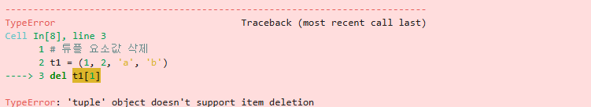
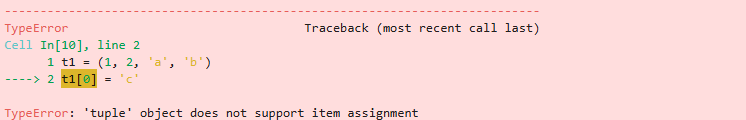
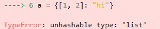
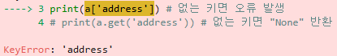
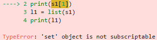
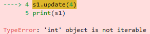
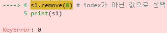

# 주요 자료형

## 리스트 자료형


```python
# 리스트 만들기
odd = [1, 3, 5, 7, 9]
```


```python
# 리스트 중요한 점, 순서! index!
a = []
b = [1, 2, 3]
c = ['Life', 'is', 'too', 'short']
d = [1, 2, 'Life', 'is']
e = [1, 2, ['Life', 'is']]
```


```python
s = "spring"
s[0]
a = [11, 22, 33, 44, 55]
print(a[0] + a[3])
```

    55


```python
a = "banana"
b = a
print(id(a))
print(id(b)) # a와 b의 주소값이 다름
b = "kiwi"
print(id(a)) # a와 b의 주소값이 다름
print(id(b)) # a와 b의 주소값이 다름
```

    130813302943888
    130813302943888
    130813302943888
    130813302944800


```python
aa = [11, 22, 33]
print(id(aa))
bb = aa
print(id(bb))
bb[0] = 33
print(id(aa))
print(id(bb))
# 리스트 객체가 메모리에 생성되고 aa는 그 객체를 참조
# bb = aa 는 새로운 리스트를 만드는 것이 아닌 aa가 참조하는 객체를
# bb도 참조하기에 이런 결과가 나온 것
# 같은 리스트를 참조하는 다른 이름인 것
```

    130813302954304
    130813302954304
    130813302954304
    130813302954304


```python
aa = [11, 22, 33]
# bb = aa.copy()
# bb = list(aa)
bb = aa[:]
print(id(aa))
print(id(bb))
```

    130813297295808
    130813297317440


```python
# 배열 초기화
cc = []
print(cc, type(cc))
dd = list()
print(dd, type(dd))
```

    [] <class 'list'>
    [] <class 'list'>


```python
# 2중 배열
li = [1, 2, 3, 4, [11, 22, 33]]
print(li)
print(li[4])
print(li[-1]) # 맨 뒷 부분
print(li[4][2])
```

    [1, 2, 3, 4, [11, 22, 33]]
    [11, 22, 33]
    [11, 22, 33]
    33


```python
# 삼중 리스트
a = [1, 2, 3, ['a', 'b', 'c', ['ok', 'Life', 'is']]]
print(a[3][3][1])
```

    Life


```python
# 리스트의 슬라이싱
a = [11, 22, 33, 44, 55]
print(a[:2])
print(a[1:3])
print(a[2:])
```

    [11, 22]
    [22, 33]
    [33, 44, 55]


```python
# 중첩된 리스트에서 슬라이싱 하기
a = [1, 2, ['0', '1', 'a', 'b', 'c'], 4, 5]
print(a[2][2:])
```

    ['a', 'b', 'c']


```python
# 리스트 더하기
a = [1, 2, 3]
b = [4, 5, 6]
print(a + b)
```

    [1, 2, 3, 4, 5, 6]


```python
# 리스트 반복
c = a * 4
print(c, len(c))
```

    [1, 2, 3, 1, 2, 3, 1, 2, 3, 1, 2, 3] 12


```python
# 리스트의 수정과 삭제
a = [11, 22, 33]
b = a.copy() # 옅은 복사를 실행하여 원본을 복사
b[2] = 777
print(a)
print(b)
```

    [11, 22, 33]
    [11, 22, 777]


```python
# 요소 삭제 *
aa = [11, 22, 33, 44, 55]
del aa[2]
print(aa)
```

    [11, 22, 44, 55]


```python
# 요소 삭제2(슬라이싱)
aa = [11, 22, 33, 44, 55]
del aa[1:3]
print(aa)
```

    [11, 44, 55]


### 리스트 관련 함수


```python
# append - 추가하기 *
a = []
a.append(1)
print(a)
a.append(2)
print(a)
a.append([11, 22, 33])
print(a)
a.append(4)
print(a)
```

    [1]
    [1, 2]
    [1, 2, [11, 22, 33]]
    [1, 2, [11, 22, 33], 4]


```python
# sort - 리스트 정렬
a = [5 ,24 ,75, 2, 43, 36 ,93]
b = ['gf', 'f', 'u', 'a', 'e', 'f', 'z', 'c']
a.sort()
b.sort()
print(a)
print(b)
```

    [2, 5, 24, 36, 43, 75, 93]
    ['a', 'c', 'e', 'f', 'f', 'gf', 'u', 'z']


```python
# reverse - 리스트 뒤집기
a = [5 ,24 ,75, 2, 43, 36 ,93]
b = ['gf', 'f', 'u', 'a', 'e', 'f', 'z', 'c']
# 원본 훼손 X
print(a[::-1])
print(b[::-1])
# 원본 훼손
a.reverse()
b.reverse()
print(a)
print(b)
```

    [93, 36, 43, 2, 75, 24, 5]
    ['c', 'z', 'f', 'e', 'a', 'u', 'f', 'gf']
    [93, 36, 43, 2, 75, 24, 5]
    ['c', 'z', 'f', 'e', 'a', 'u', 'f', 'gf']


```python
# sort와 reverse 응용
a = [5 ,24 ,75, 2, 43, 36 ,93]
a.sort()
a.reverse() # a[::-1]
print(a)

b = [5 ,24 ,75, 2, 43, 36 ,93]
b.sort(reverse=True) # True는 내림차순, False는 오름차순이 기본값
print(b)

# sort, reverse는 반환값 없음(결과: None)
print(a.sort())
print(a.reverse())
```

    [93, 75, 43, 36, 24, 5, 2]
    [93, 75, 43, 36, 24, 5, 2]
    None
    None


```python
# sorted - 원본 유지하기
aa = [66, 7, 8, 99, 0]
print(sorted(aa))
print(sorted(aa, reverse=True))
print(aa)
```

    [0, 7, 8, 66, 99]
    [99, 66, 8, 7, 0]
    [66, 7, 8, 99, 0]


```python
# sorted 응용하기
fruit = ["apple", "banana", "orange", "kiwi", "strawberry"]
print(sorted(fruit, key=len)) # 문자열의 길이 기준으로 정렬
print(sorted(fruit, key=len, reverse="True"))
```

    ['kiwi', 'apple', 'banana', 'orange', 'strawberry']
    ['strawberry', 'banana', 'orange', 'apple', 'kiwi']


```python
# index - 인덱스반환
a = [1, 2, 3, 4]
print(a.index(3))
# print(a.index(11))
```

    2


**없으면 오류**


```python
# index 응용
fruit = ["apple", "banana", "orange", "kiwi", "strawberry"]
inp = input("좋아하는 과일")
# melon 을 선택 -> melon 인덱스 추출
n = fruit.index(inp)
print(f"{inp}을 좋아하시는 군요. {n + 1} 번째에 있습니다")
```

    좋아하는 과일 apple


    apple을 좋아하시는 군요. 1 번째에 있습니다


```python
# insert - 리스트에 요소 삽입 *
a = [1, 2, 3 ,4 ,5 ,6]
a.insert(0, 77) # 원래 그 자리에 있던 요소는 뒤로 밀고 삽입
print(a)
a.insert(3, 177)
print(a)
a.insert(5, [1, 2, 3])
print(a)
a.insert(len(a), 11177) # 배열 맨 뒤에 추가하려면 len() 함수가 편함
print(a)
```

    [77, 1, 2, 3, 4, 5, 6]
    [77, 1, 2, 177, 3, 4, 5, 6]
    [77, 1, 2, 177, 3, [1, 2, 3], 4, 5, 6]
    [77, 1, 2, 177, 3, [1, 2, 3], 4, 5, 6, 11177]


```python
# remove 리스트 요소 제거
a = [1, 2, 3] * 3 
a.remove(2) # 인덱스 가장 앞에 있는 그 값을 삭제
print(a)
```

    [1, 3, 1, 2, 3, 1, 2, 3]


```python
# pop 리스트 요소 꺼내기 **
a = [1, 2, 3, 4, 5]
out = a.pop(0) # 값을 넣으면 인덱스의 요소를 반환하고 그 요소는 삭제
print(out, a) # 값이 없을 때(기본값)는 맨 뒤에서 부터 꺼내면서 삭제
out = a.pop(0)
print(out, a)
out = a.pop(0)
print(out, a)
out = a.pop(0)
print(out, a)
out = a.pop(0)
print(out, a)
```

    1 [2, 3, 4, 5]
    2 [3, 4, 5]
    3 [4, 5]
    4 [5]
    5 []


```python
# count 리스트에 포함된 요소 개수 세기
a = [2, 3, 4, 6]*2 + [1, 2, 3]*3
print(a, a.count(4))
```

    [2, 3, 4, 6, 2, 3, 4, 6, 1, 2, 3, 1, 2, 3, 1, 2, 3] 2


```python
# extend 리스트 확장
a = [1, 2, 3]
a.extend([4, 5])
print(a)
```

    [1, 2, 3, 4, 5]


### 응용 문제


```python
# 장바구니
bag = [] # bag = list()
```


```python
# append를 이용한 자료 넣기
item = input("필요한 항목을 넣어주세요")
bag.append(item)
print("장바구니에는 {0} 들이 들어 있습니다.".format(bag))
```

    필요한 항목을 넣어주세요 감자


    장바구니에는 ['사과', '사과', '바나나', '감자'] 들이 들어 있습니다.


```python
# FIFO
hand = bag.pop(0)
print("%s를 꺼내서 장바구니에 %s가 남았습니다." % (hand, bag))
```

    사과를 꺼내서 장바구니에 ['사과', '바나나']가 남았습니다.


- 선택 출력
> "바구니에 ['호박', '감자', '소주', '맥주', '치킨', '피자'] 이 있습니다."
> "꺼내고 싶은 물품을 입력하세요"
> "바구니에서 ??? 을 꺼내어 [~, ~, ~, ~] 가 남았습니다."


```python
baguni = ['호박', '감자', '소주', '맥주', '치킨', '피자']
print("바구니에 {0}이 있습니다".format(baguni))
item = input("꺼내고 싶은 물품을 입력하세요")
baguni.pop(baguni.index(item))
print("바구니에서 %s 을 꺼내어 %s 가 남았습니다." % (item, baguni))
```

    바구니에 ['호박', '감자', '소주', '맥주', '치킨', '피자']이 있습니다


    꺼내고 싶은 물품을 입력하세요 호박


    바구니에서 호박 을 꺼내어 ['감자', '소주', '맥주', '치킨', '피자'] 가 남았습니다.


```python
# 문제2
# 위치 지정 물품 추가
box = ['호박', '감자', '소주', '맥주', '치킨', '피자']
# 입력받기1: "추가할 물건 이름을 적어주세요."
# 입력받기2: "어느 물품 뒤에 넣어둘까요?"
# box 를 출력하기
item = input("추가할 물건 이름을 적어주세요")
i = input("어느 물품 뒤에 넣어둘까요?")
box.insert(box.index(i) + 1, item)
print(box)
```

    추가할 물건 이름을 적어주세요 고구마
    어느 물품 뒤에 넣어둘까요? 맥주


    ['호박', '감자', '소주', '맥주', '고구마', '치킨', '피자']


## 튜플 자료형


```python
t1 = ()
t2 = (1,) # *
t3 = (1, 2, 3)
t4 = 1, 2, 3 # *
t5 = ('a', 'b', ('ab', 'cd'))
```


```python
# 주의점
t2 = (4234,)
print(type(t2))
t4 = 123
print(type(t4))
```

    <class 'tuple'>
    <class 'int'>


```python
# 튜플 요소값 삭제
t1 = (1, 2, 'a', 'b')
# del t1[1]
```

**튜플은 요소 삭제 안됨**




```python
t1 = (1, 2, 'a', 'b')
# t1[0] = 'c'
```

**튜플은 요소 변경 안됨**




```python
# 인덱싱 하기
t1 = (1, 2, 'a', 'b')
print(t1[0])
print(t1[3])
```

    1
    b


```python
# 슬라이싱
t1 = 1, 2, 'a', 'b'
print(t1[1:])
```

    (2, 'a', 'b')


```python
# 튜플 더하기
t1 = (1, 2, 'a', 'b')
t2 = (3, 4)
t3 = t1 + t2
t3
```


    (1, 2, 'a', 'b', 3, 4)


```python
# 튜플 곱하기
t2 = (3, 4)
t3 = t2 * 3
t3
```


    (3, 4, 3, 4, 3, 4)


```python
# 튜플 길이 구하기
t1 = (1, 2, 'a', 'b')
len(t1)
```


    4


## 딕셔너리 자료형 


```python
# 딕셔너리 초기화
dic0 = {}
print(dic0, type(dic0))
dic1 = dict()
print(dic1, type(dic1))
```

    {} <class 'dict'>
    {} <class 'dict'>


```python
# 딕셔너리 만들기
dic = {'name': 'pey', 'phone': '010-9999-1234', 'birth': '1118'}
dic1 = {0: 'pey', 1: '010-9999-1234', 2: '1118'}
```

<table style="float:left">
<thead>
<tr>
<th>key</th>
<th>value</th>
</tr>
</thead>
<tbody>
<tr>
<td>name</td>
<td>pey</td>
</tr>
<tr>
<td>phone</td>
<td>010-9999-1234</td>
</tr>
<tr>
<td>birth</td>
<td>1118</td>
</tr>
</tbody>
</table>


```python
# 쌍 추가
print(dic)
dic['address'] = "서울"
print(dic)
```

    {'name': 'pey', 'phone': '010-9999-1234', 'birth': '1118'}
    {'name': 'pey', 'phone': '010-9999-1234', 'birth': '1118', 'address': '서울'}


```python
# 숫자 키
dic1[1] = "일"
print(dic1)
```

    {0: 'pey', 1: '일', 2: '1118'}


```python
# 문자로 된 숫자 키
dic1["1"] = "일"
print(dic1)
```

    {0: 'pey', 1: '일', 2: '1118', '1': '일'}


```python
# 딕셔너리 내부 다른 자료형
dic['리스트'] = [11, 22, 33]
dic['튜플'] = 44, 55, 66
dic['딕셔너리'] = {"name": "홍길동"}
print(dic)
```

    {'name': 'pey', 'phone': '010-9999-1234', 'birth': '1118', 'address': '서울', '리스트': [11, 22, 33], '튜플': (44, 55, 66), '딕셔너리': {'name': '홍길동'}}


```python
# 쌍 삭제
del dic1['1']
print(dic1)
```

    {0: 'pey', 1: '일', 2: '1118'}


```python
# 문제
name = {"김연아": "피겨스케이팅", "류현진": "야구", "손흥민": "축구", "귀도": "파이썬"}
# 변경 - 김연아 : 은퇴
name["김연아"] = "은퇴"
print(name)
# 추가 - 김연경 : 배구
name["김연경"] = "배구"
print(name)
# 삭제 - 귀도
del name["귀도"]
print(name)
```

    {'김연아': '은퇴', '류현진': '야구', '손흥민': '축구', '귀도': '파이썬'}
    {'김연아': '은퇴', '류현진': '야구', '손흥민': '축구', '귀도': '파이썬', '김연경': '배구'}
    {'김연아': '은퇴', '류현진': '야구', '손흥민': '축구', '김연경': '배구'}


```python
# 주의사항
# key가 두개 이상이면 안된다
a = {1: 'a', 1: 'b'}
print(a)
# key값에는 리스트나 딕셔너리같은 mutable 형식이 되면 안된다. (튜플 가능)
# a = {[1, 2]: "hi"}
# key 값에 딕셔너리?
# a = {{1: "hello"}: "hi"}
```

    {1: 'b'}


**리스트를 key로 사용한 경우**



**딕셔너리에 딕셔너리를 key로 사용한 경우**


### 딕셔너리 관련 함수


```python
# keys - 키 리스트 만들기
a = {'name': 'pey', 'phone': '010-9999-1234', 'birth': '1118'}
ky = a.keys()
l_ky = list(ky)
print(ky) # key값만 담은 리스트 객체 반환
print(ky, type(a), type(ky), type(l_ky), sep="\n")
print(a)
```

    dict_keys(['name', 'phone', 'birth'])
    dict_keys(['name', 'phone', 'birth'])
    <class 'dict'>
    <class 'dict_keys'>
    <class 'list'>
    {'name': 'pey', 'phone': '010-9999-1234', 'birth': '1118'}


```python
# values - 값 리스트 만들기
a = {'name': 'pey', 'phone': '010-9999-1234', 'birth': '1118'}
va = a.values()
l_va = list(va)
print(va) # key값만 담은 리스트 객체 반환
print(va, type(a), type(va), type(l_va), sep="\n")
print(a)
```

    dict_values(['pey', '010-9999-1234', '1118'])
    dict_values(['pey', '010-9999-1234', '1118'])
    <class 'dict'>
    <class 'dict_values'>
    <class 'list'>
    {'name': 'pey', 'phone': '010-9999-1234', 'birth': '1118'}


```python
# items - 키, 값 쌍을 리스트안의 튜플로 만들기
a = {'name': 'pey', 'phone': '010-9999-1234', 'birth': '1118'}
it = a.items()
l_it = list(it)
print(it) # key값만 담은 리스트 객체 반환
print(it, type(a), type(it), type(l_it), sep="\n")
print(a)
```

    dict_items([('name', 'pey'), ('phone', '010-9999-1234'), ('birth', '1118')])
    dict_items([('name', 'pey'), ('phone', '010-9999-1234'), ('birth', '1118')])
    <class 'dict'>
    <class 'dict_items'>
    <class 'list'>
    {'name': 'pey', 'phone': '010-9999-1234', 'birth': '1118'}


```python
# clear - 키, 값 쌍 모두 지우기
a = {'name': 'pey', 'phone': '010-9999-1234', 'birth': '1118'}
print(a)
a.clear()
print(a)
```

    {'name': 'pey', 'phone': '010-9999-1234', 'birth': '1118'}
    {}


```python
# get - 키로 값 얻기
a = {'name': 'pey', 'phone': '010-9999-1234', 'birth': '1118'}
# 없는 키면 오류 발생
print(a['name'])
# 없는 키면 "None" 반환
print(a.get('address'))
# 없는 키일 때 "None"이 아닌 다른 문자열 반환
print(a.get('address', "없습니다"))
```

    pey
    None
    없습니다


**해당 값이 없을 때 오류**




```python
# in - 해당 키 값 조사하기 **
a = {'name': 'pey', 'phone': '010-9999-1234', 'birth': '1118'}
print("name" in a)
print("ok" in a)
```

    True
    False


```python
# pop - 가져와서 삭제하기
a = {'name': 'pey', 'phone': '010-9999-1234', 'birth': '1118'}
pp = a.pop("name")
print("꺼낸 값:", pp)
print("남은 값:", a)
```

    꺼낸 값: pey
    남은 값: {'phone': '010-9999-1234', 'birth': '1118'}


```python
# 응용 실습
import requests as r
url = "https://www.koreaexim.go.kr/site/program/financial/exchangeJSON?authkey=3spOQb36RyxH4cbtYdC1igtjlbe6K1YU&data=AP01"
result = r.get(url).json()
# print(result, type(result)) # json 형식으로 받으면 타입이 리스트임
print(result[-1]['cur_unit'], ":", result[-1]['deal_bas_r'])
```

    USD : 1,451.2


```python
# 이전에 알아낸 실시간 비트코인 BTC / USD 가격으로
# 실시간 환율을 계산하여 지금 비트코인 가격을 원화로 표시하시오.
# py 파일로 저장하여 python3로 실행하시오.
import requests as r
btc = "https://api4.binance.com/api/v3/ticker/price?symbol=BTCUSDT"
usd = "https://www.koreaexim.go.kr/site/program/financial/exchangeJSON?authkey=3spOQb36RyxH4cbtYdC1igtjlbe6K1YU&data=AP01"
r1 = r.get(btc).json()
r2 = r.get(usd).json()
r3 = float(r1['price']) * float(r2[-1]['deal_bas_r'].replace(',', ''))
print(f"{int(r3):,}", "원")
```

    103,543,178 원


**JSON**

배열 자료형, 키-값 쌍 등으로 이루어진 데이터 오브젝트를 전달하기 위해 인간이 읽을 수 있는 텍스트를 사용하는 개방형 표준 포맷.
요는 데이터를 전달해야 할 때 필요한 양식의 개념이다.

## 집합 자료형


```python
# 집합 자료형 초기화
s = set()
print(s, type(s))
```

    set() <class 'set'>


```python
# set 자료형 중복 허용 안함
li = [1, 2, 3]*2 + [1, 22, 33]*3
print(li)
s1 = set(li)
print(s1)
```

    [1, 2, 3, 1, 2, 3, 1, 22, 33, 1, 22, 33, 1, 22, 33]
    {1, 2, 3, 33, 22}


```python
# set 자료형 순서 없음, 인덱싱으로 요소값 얻을 수 없음
s2 = set("Hello")
print(s2)
```

    {'l', 'o', 'H', 'e'}


```python
s1 = set([1, 2, 3])
# print(s1[1])
l1 = list(s1)
print(l1)
print(l1[0])
t1 = tuple(s1)
print(t1)
print(t1[0])
```

    [1, 2, 3]
    1
    (1, 2, 3)
    1


**인덱싱으로 요소값 얻기 불가**




```python
# 문제
access_logs = ["192.168.0.1", "192.168.0.2", "192.168.0.1",
              "10.0.0.1", "192.168.0.2", "192.168.0.5"]
a = set(access_logs)
a.add("192.168.0.99")
print(a)
```

    {'192.168.0.99', '10.0.0.1', '192.168.0.1', '192.168.0.5', '192.168.0.2'}


```python
# 교집합, 합집합, 차집합
s1 = set([1, 2, 3, 4, 5, 6])
s2 = set([4, 5, 6, 7, 8, 9])
print("교집합", s1 & s2) # s1.intersection(s2) 가능
print("합집합", s1 | s2) # s1.union(s2) 가능
print("차집합", s1 - s2) # s1.difference(s2) 가능
```

    교집합 {4, 5, 6}
    합집합 {1, 2, 3, 4, 5, 6, 7, 8, 9}
    차집합 {1, 2, 3}


### 집합 자료형 관련 함수


```python
# add - 집합 자료형 값 1개 추가
s1 = set([1, 2, 3])
print(s1)
s1.add(4)
print(s1)
```

    {1, 2, 3}
    {1, 2, 3, 4}


```python
# update - 집합 자료형 값 여러 개 추가
s1 = set([1, 2, 3])
print(s1)
s1.update([2, 3, 4, 5, 6, 7])
print(s1) # 중복을 허용하지 않기에 2, 3 은 2개가 되지 않음
```

    {1, 2, 3}
    {1, 2, 3, 4, 5, 6, 7}


**값이 1개만 들어 갈 경우 오류**




```python
# remove - 집합 자료형 특정 값 제거하기
s1 = set([1, 2, 3])
print(s1)
s1.remove(2) # index가 아닌 값으로 선택
print(s1)
```

    {1, 2, 3}
    {1, 3}


**존재하지 않는 값을 넣으면 오류**




```python
# discard - 집합 자료형 특정 값 제거하기
s1 = set([1, 2, 3])
print(s1)
s1.discard(4) # 없는 값을 제거하려 해도 오류 발생X
print(s1)
```

    {1, 2, 3}
    {1, 2, 3}


```python
# clear - 집합 자료형 내 모든 값 제거
s1 = set([1, 2, 3])
s1.clear()
print(s1)
```

    set()


## 불 자료형


```python
a = True
b = False
print(type(a), type(b))
```

    <class 'bool'> <class 'bool'>


```python
a = 13 > 4
print(a, type(a))
a = 13 < 4
print(a, type(a))
a = 13 == 4
print(a, type(a))
a = 13 != 4
print(a, type(a))
```

    True <class 'bool'>
    False <class 'bool'>
    False <class 'bool'>
    True <class 'bool'>


<table style="float:left">
<thead>
<tr>
<th>값</th>
<th>참 or 거짓</th>
</tr>
</thead>
<tbody>
<tr>
<td>"python"</td>
<td>참</td>
</tr>
<tr>
<td>""</td>
<td>거짓</td>
</tr>
<tr>
<td>[1, 2, 3]</td>
<td>참</td>
</tr>
<tr>
<td>[]</td>
<td>거짓</td>
</tr>
<tr>
<td>(1, 2, 3)</td>
<td>참</td>
</tr>
<tr>
<td>()</td>
<td>거짓</td>
</tr>
<tr>
<td>{'a': 1}</td>
<td>참</td>
</tr>
<tr>
<td>{}</td>
<td>거짓</td>
</tr>
<tr>
<td>1</td>
<td>참</td>
</tr>
<tr>
<td>0</td>
<td>거짓</td>
</tr>
<tr>
<td>None</td>
<td>거짓</td>
</tr>
</tbody>
</table>


```python
print("python", bool("python"), sep=" : ")
print("\"\"", bool(""), sep=" : ")
print("[1, 2, 3]", bool([1, 2, 3]), sep=" : ")
print("[]", bool([]), sep=" : ")
print("(1, 2, 3)", bool((1, 2, 3)), sep=" : ")
print("()", bool(()), sep=" : ")
print("{'a': 1}", bool({'a': 1}), sep=" : ")
print("{}", bool({}), sep=" : ")
print("1", bool(1), sep=" : ")
print("0", bool(0), sep=" : ")
print("None", bool(None), sep=" : ")
```

    python : True
    "" : False
    [1, 2, 3] : True
    [] : False
    (1, 2, 3) : True
    () : False
    {'a': 1} : True
    {} : False
    1 : True
    0 : False
    None : False


### 논리 연산자


```python
# and 연산자
print(True and True)
print(True and False)
print(False and True)
print(False and False)
```

    True
    False
    False
    False


```python
# or 연산자
print(True or True)
print(True or False)
print(False or True)
print(False or False)
```

    True
    True
    True
    False


```python
# not 연산자
print(not True)
print(not False)
print(not 1)
print(not 0)
```

    False
    True
    False
    True


```python

```
