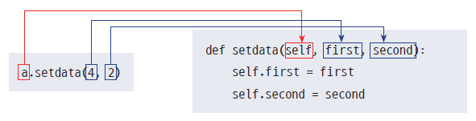

# 심화

## 클래스


```python
result1 = 0
result2 = 0

def add1(num):
    global result1
    result1 += num  # 결괏값(result)에 입력값(num) 더하기
    return result1  # 결괏값 리턴

def add2(num):
    global result2
    result2 += num  # 결괏값(result)에 입력값(num) 더하기
    return result2  # 결괏값 리턴
```


```python
print(add1(3))
print(add2(4))
```

    3
    4


```python
class Calculator:
    def __init__(self):
        self.result = 0

    def add(self, num):
        self.result += num
        return self.result

    def mul(self, num):
        self.result *= num
        return self.result

cal1 = Calculator()
cal2 = Calculator()

print(cal1.add(3))
print(cal1.mul(3))
```

    3
    9


```python
# 클래스의 기본 뼈대
class Cookie:
    pass

a = Cookie()
# 객체와 인스턴스 차이
# 인스턴스(instance) = 클래스(class)로부터 실제로 만들어진 객체(object)
```


```python
# 클래스 구조 만들기
class FourCal:
    def setdata(self, a, b):
        self.first = a
        self.second = b
    def print(self):
        print(self.first, self.second)

four1 = FourCal()
four1.setdata(3, 4)
four1.print()
```

    3 4





```python
# 예제1

class DDuk:
    def __init__(self, won, ea):
        self.won = won
        self.ea = ea

    def dduk(self):
        result = self.won * self.ea
        print(f"배가 고파서 떡 {result}원어치를 먹었다.")

    def odeng(self):
        result = self.won * 2 *self.ea
        print(f"배가 고파서 어묵 {result}원어치를 먹었다.")
```


```python
a = DDuk(2000, 4)
a.dduk()
```

    배가 고파서 떡 8000원어치를 먹었다.


```python
# 예제2
class Pet:
    def __init__(self, name, species):
        """펫을 생성"""
        self.name = name
        self.species = species
        self.hunger = 50

    def feed(self):
        """밥을 주면 배고픔 감소"""
        if self.hunger > 10:
            self.hunger -= 10
        return f"{self.name}에게 밥을 줬어요. 배고픔: {self.hunger}"

    def play(self):
        """놀아 주면 배고픔 증가"""
        if self.hunger < 70:
            self.hunger += 20
        else:
            return f"배가 고파요 밥을 먼저 주세요. 배고픔: {self.hunger}"
        return f"{self.name}와 잘 놀았어요. 배고픔: {self.hunger}"
```


```python
dog = Pet("뽀삐", "말티즈")
print(dog.play())
print(dog.play())
```

    뽀삐와 잘 놀았어요. 배고픔: 70
    배가 고파요 밥을 먼저 주세요. 배고픔: 70


```python
# 예제3
class Bacteria:
    def __init__(self, population, growth):
        """세균 초기화"""
        self.population = population
        self.growth = growth
        self.time = 0 # 시작 시간
    
    def grow(self, hours):
        """일정 시간이 지나면 세균이 증식"""
        self.time = hours
        self.population *= self.growth**hours
        return f"{self.time}시간 후 세균수: {self.population}마리"

    def check(self):
        """현재 세균 수 확인"""
        print(f"현재 세균 수: {self.population}마리")
```


```python
samp1 = Bacteria(200, 2)
samp2 = Bacteria(400, 2)
samp3 = Bacteria(1400, 1.5)
```


```python
samp1.grow(2)
```


    '2시간 후 세균수: 800마리'


```python
samp1.check()
```

    현재 세균 수: 800마리


```python
# 예제4 캡슐화
class Bank:
    __interest_rate = 0.02 # 클래스 변수 p210
    def __init__(self, owner, balance):
        self.owner = owner
        self.__balance = balance or 0

    def bprint(self): # 잔액조회
        return f"{self.owner}님의 잔고는 {self.__balance}원 입니다."

    def deposit(self, amount):
        self.__balance += amount
        return f"{self.owner}님의 계좌에 {amount}원이 입금 되었습니다. 현재 잔액: {self.__balance}원"

    def withdraw(self, amount):
        if self.__balance >= amount:
            self.__balance += amount
            return f"{self.owner}님의 계좌에 {amount}원이 출금 되었습니다. 현재 잔액: {self.__balance}원"
        return "잔액이 부족합니다."

    def interest(self):
        self.__balance = self.__balance * (1 + self.interest_rate)
        return f"{self.__interest_rate}%의 이자가 반영 되었습니다. 현재 잔액: {self.__balance:.2f}원"
```


```python
acc1 = Bank("철수", 5000)
acc2 = Bank("영희", 1000)
acc3 = Bank("유진스", 50000)
acc4 = Bank("병우스", 15000)
```


```python
print(acc1.bprint())
print(acc2.bprint())
print(acc3.bprint())
print(acc4.bprint())
```

    철수님의 잔고는 5000원 입니다.
    영희님의 잔고는 1000원 입니다.
    유진스님의 잔고는 50000원 입니다.
    병우스님의 잔고는 15000원 입니다.


```python
acc2.deposit(10000)
```


    '영희님의 계좌에 10000원이 입금 되었습니다. 현재 잔액: 21000원'


```python
acc4.withdraw(14000)
```


    '병우스님의 계좌에 14000원이 출금 되었습니다. 현재 잔액: 58171.600000000006원'


```python
print(acc1.interest())
print(acc2.interest())
print(acc3.interest())
print(acc4.interest())
```

    0.02%의 이자가 반영 되었습니다. 현재 잔액: 5412.1608원
    0.02%의 이자가 반영 되었습니다. 현재 잔액: 1082.43216원
    0.02%의 이자가 반영 되었습니다. 현재 잔액: 108242.13356784원
    0.02%의 이자가 반영 되었습니다. 현재 잔액: 16236.4824원


```python
Bank.__interest_rate = 0.03
```


```python
acc3.balance = 99999
acc3.__balance = 99999
acc3.bprint()
```


    '유진스님의 잔고는 99999원 입니다.'


```python
acc3.balance
```


    99999


```python
acc3.__balance
```


    99999


```python
# 예제 5 응용
import random

class Character:
    def __init__(self, name, hp, attack_p):
        """캐릭터 초기화"""
        self.name = name
        self.hp = hp
        self.attack_p = attack_p

    def attack(self, opponent):
        """상대방을 공격"""
        damage = random.randint(2, self.attack_p)
        opponent.hp -= damage
        print(f"{self.name}가 {opponent.name}을 공격하여 {damage}를 입혔습니다.")

    def status(self):
        """현재 체력 상태 확인"""
        return f"{self.name} 체력: {self.hp}"

    def is_alive(self):
        """캐릭터 생존 여부 확인"""
        return self.hp > 0
        
```


```python
player = Character("영웅", attack_p = 15, hp = 50) # 명시적으로 이름을 넣고 값을 넣으면 순서 상관없이 넣을 수 있음
monster = Character("골램", 60, 9)
```


```python
# 전투 시작
import time as tt

print(f"{'전투시작':=^30}")

while player.is_alive() and monster.is_alive():
    # input("경기를 시작하려면 엔터를 치세요.")
    tt.sleep(2)
    if player.is_alive(): player.attack(monster)
    if monster.is_alive(): monster.attack(player)
    print(player.status(), ' vs ', monster.status(), "\n")

# 결과
if player.is_alive():
    print("승리")
else:
    print("패배")
```

    =============전투시작=============
    영웅가 골램을 공격하여 15를 입혔습니다.
    골램가 영웅을 공격하여 3를 입혔습니다.
    영웅 체력: 47  vs  골램 체력: 45 
    
    영웅가 골램을 공격하여 14를 입혔습니다.
    골램가 영웅을 공격하여 8를 입혔습니다.
    영웅 체력: 39  vs  골램 체력: 31 
    
    영웅가 골램을 공격하여 11를 입혔습니다.
    골램가 영웅을 공격하여 7를 입혔습니다.
    영웅 체력: 32  vs  골램 체력: 20 
    
    영웅가 골램을 공격하여 5를 입혔습니다.
    골램가 영웅을 공격하여 4를 입혔습니다.
    영웅 체력: 28  vs  골램 체력: 15 
    
    영웅가 골램을 공격하여 12를 입혔습니다.
    골램가 영웅을 공격하여 7를 입혔습니다.
    영웅 체력: 21  vs  골램 체력: 3 
    
    영웅가 골램을 공격하여 12를 입혔습니다.
    영웅 체력: 21  vs  골램 체력: -9 
    
    승리


## 상속과 메서드 오버라이딩


```python
# ㄱ앞의 예제 2번을 가져와서...
class Pet:
    def __init__(self, name, species):
        """펫을 생성"""
        self.name = name
        self.species = species
        self.hunger = 50

    def feed(self):
        """밥을 주면 배고픔 감소"""
        if self.hunger > 10:
            self.hunger -= 10
        return f"{self.name}에게 밥을 줬어요. 배고픔: {self.hunger}"

    def play(self):
        """놀아 주면 배고픔 증가"""
        if self.hunger < 70:
            self.hunger += 20
        else:
            return f"배가 고파요 밥을 먼저 주세요. 배고픔: {self.hunger}"
        return f"{self.name}와 잘 놀았어요. 배고픔: {self.hunger}"
```


```python
# 상속받아서 새로운 클래스 생성, 메서드 오버라이딩
class MyPet(Pet): # class Pet을 상속 받음
    def cry(self): # 상속 받은 후, 기능 추가
        print("크르릉") 

    def play(self): # 상속 받은 기능 재설정
        print("놀기 싫다")
```


```python
dog5 = MyPet("포치", "시바")
print(dog5.feed())
```

    포치에게 밥을 줬어요. 배고픔: 40


```python
dog5.cry()
```

    크르릉


```python
dog5.play() # 상속 받은 함수를 덮어 씌우는 것도 가능
```

    놀기 싫다


```python

```
